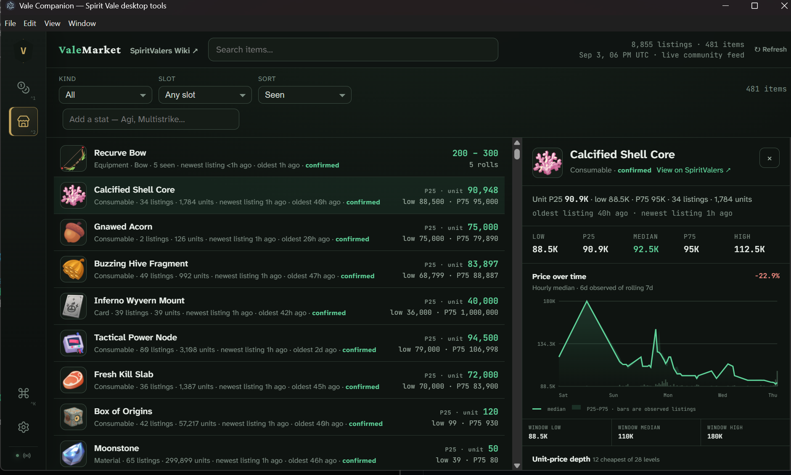

# Vale Companion

Vale Companion is the preferred desktop companion for **Spirit Vale**. It combines the ValeLoot live bag and rule-based alerts, live gold-session analytics, and the ValeMarket browser with passive community contribution in one application.



- No DLL injection, BepInEx, runtime patching, or game-file modification
- No gameplay automation, input simulation, buying, selling, dismantling, or item movement
- Passive, process-scoped network observation through Npcap on Windows or libpcap/dumpcap on Linux
- Local loot rules, profiles, alert history, and sounds
- Equipment, artifacts, gems, and stack-aware card tracking
- Live inventory updates for drops, dismantling, selling, and personal-storage transfers
- Live gross and net gold rates, spending, earning events, and recorded-kill efficiency
- Current market listings and seven-day observed asking-price summaries
- Optional market contribution; raw packets never leave the device

> **Download:** Get the latest build from [GitHub Releases](https://github.com/bjb2/valecompanion/releases/latest). Do not use GitHub's source-code ZIP as an application installer.

## Install

### Windows

Requirements:

- Windows 10 or 11, x64
- [Npcap](https://npcap.com/#download), installed separately
- Spirit Vale

1. Install Npcap using its default options.
2. Download `ValeCompanion-<version>-windows-x64-setup.exe` from the [latest release](https://github.com/bjb2/valecompanion/releases/latest).
3. Run the installer as your normal user. It installs for your account and supports in-app updates. The executable without `-setup` is an optional portable download with manual replacement.
4. Start Spirit Vale. Vale Companion automatically selects the active network adapter and begins observing the game connection.

Npcap is not bundled. Without it, Vale Companion still opens its market browser and settings, but cannot observe inventory or contribute market listings.

Windows builds are currently unsigned, so Windows may show an unknown-publisher warning. Verify that the download came from this repository and compare its SHA-256 checksum with the release's `SHA256SUMS.txt` file.

### Linux

Requirements:

- Linux x64
- Spirit Vale running natively or through Proton
- libpcap
- `dumpcap` from Wireshark, recommended, or `CAP_NET_RAW` and `CAP_NET_ADMIN` on the packaged collector runtime

Native `.deb` and `.rpm` packages configure the collector's packet-capture capabilities during installation. Run Vale Companion as your normal user; do not run the desktop application with `sudo`.

The AppImage is portable but cannot retain Linux file capabilities. AppImage users should configure their distribution's `dumpcap` package for non-root capture. On Debian or Ubuntu, install `libpcap0.8` and `wireshark-common`, allow non-superusers to capture when prompted, add your account to the `wireshark` group, then sign out and back in.

## Updates

Vale Companion checks for stable releases shortly after startup and every six hours. An in-app notice offers release details, **Later**, and **Update and restart**. Settings includes **Check for updates**, **Skip this version**, and a toggle to disable automatic checks.

Nothing downloads or installs until you choose **Update and restart**. That action downloads and verifies the update, saves the current session, stops capture, installs, and restarts. Closing the app normally never installs a pending update. Windows installer and Linux AppImage builds support this flow; DEB/RPM updates may request system authorization. AppImages must be in a writable folder. Windows portable builds link to GitHub Releases for manual replacement.

Older releases need one manual download to acquire this updater. Normal application data stays in place. If you use `.valecompanion-portable` on Windows, keep replacing the portable executable beside its `data` folder, or close the app, back up that folder, and copy its contents into `%APPDATA%\Vale Companion` before opening the installed edition. Reconcile any existing destination data first.

See [release maintenance](docs/releases.md) for the build workflow and upgrade validation.

## Loot workspace

Vale Companion maintains a live view of the character bag from authoritative server inventory updates. It tracks:

- Equipment and artifacts, including substats, roll percentages, chaos lines, refinement, and favorites
- Gems and refinement levels
- Cards and stack quantities
- Additions and removals caused by drops, sales, dismantling, and personal-storage transfers

A fresh installation includes a focused starter ruleset in [`docs/starter-ruleset.txt`](docs/starter-ruleset.txt). Rules are evaluated from top to bottom; the first matching rule wins. Rules only change presentation and local alerts.

```text
Show "high-roll armor"
  Type Chest, Feet, Head, Legs, Shield
  HighRolls >= 2
  Color #35e87a
  Tag ARMOR
  Highlight mark
  Background fill
  Sound chime

Show "cards"
  Type Card
  Color #d6ad4a
  Tag CARD
  Highlight glow
```

Use the in-app editor to validate rules, manage profiles, choose colors and emphasis, and configure built-in or custom WAV sounds.

## Gold analytics

The Gold workspace starts a local session from the first authoritative coin total sent by the game server. It separates positive and negative balance changes, then reports gross gold per hour and minute, net gold per hour, a rolling 15-minute pace, earning and spending events, and a one-hour five-minute-bucket chart. Large values use compact notation with the exact amount available on hover.

**Finish session** saves the run's yield, spend, rates, and kill efficiency in the previous-sessions ledger, then keeps the current balance as the next baseline. Finished sessions and the active session are stored locally and survive application restarts; the most recent 100 finished sessions are retained. Each saved session can be deleted independently, or the entire history can be cleared.

Gold per confirmed kill uses the cumulative kill count included in character snapshots, paired at each observed gold balance update. Kills received after the latest balance update remain visible as pending instead of distorting the ratio.

## Market workspace

The market browser loads the current public listing snapshot from [market.spiritvalers.com](https://market.spiritvalers.com/). Item inspectors show a rolling seven-day series of hourly observed asking-price quartiles. These are listing observations, not completed-sale history.

Market contribution is enabled on fresh installations and can be disabled under **Settings → Market contribution**. The contributor observes market result traffic already delivered to the game client, normalizes supported listing fields, suppresses duplicates, and uploads bounded batches to the public service.

## Privacy and game boundary

Vale Companion is passive:

- It sends no gameplay RPCs or packets.
- It never clicks, types, moves, equips, buys, sells, dismantles, or picks up items.
- It does not inject code into Spirit Vale or modify the game installation.
- Loot inventory, gold analytics, filters, profiles, sounds, and alert history stay local.
- Raw captured packets are not persisted or uploaded.
- Market contribution sends normalized listing observations, not account credentials, character identity, seller identity, buyer identity, or raw packet payloads.

Capture can be disabled entirely, and market contribution has a separate toggle.

## Data and diagnostics

Settings and structured logs use the operating system's application-data directory. To keep data beside the executable or AppImage, place an empty `.valecompanion-portable` file beside it before launch.

Diagnostics cover application startup, capture selection, packet decoding, and contribution lifecycle events. They exclude raw packets, installation tokens, listing payloads, and player identity.

## Build from source

Prerequisites:

- Windows x64 or Linux x64
- [Bun](https://bun.sh/) 1.4 or newer
- Platform capture dependencies described above

```sh
git clone https://github.com/bjb2/valecompanion.git
cd valecompanion
bun install
bun run check
bun run dev
```

Useful commands:

```text
bun run dev           Build and launch a development window
bun run check         Type-check and run the complete test suite
bun run build         Prepare the Electron application
bun run package:win   Build Windows installer and portable executable; smoke-test portable
bun run package:linux Build Linux AppImage, deb, and rpm artifacts
```

## Project layout

```text
src/backend/       Capture lifecycle, local API, persistence, and market contribution
src/core/          Character decoding, inventory projection, loot rules, and gold analytics
src/electron/      Desktop shell and collector supervision
src/frontend/      Companion navigation, settings, loot, and gold workspaces
prototype/         Local market UI development server
test/              Decoder, capture, filter, and session contract tests
docs/              Starter ruleset and supporting assets
```

## License

Vale Companion is licensed under the GNU Affero General Public License, version 3 or later. See [LICENSE](LICENSE), [NOTICE](NOTICE), and [SOURCE-OFFER.txt](SOURCE-OFFER.txt).

Spirit Vale is a third-party game. Vale Companion is an independent community project and is not endorsed by or affiliated with the game's developer or publisher.
